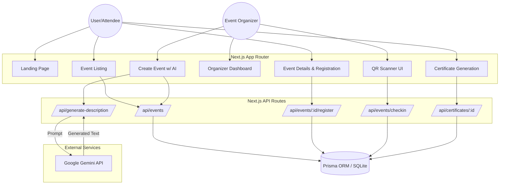

# Architecture Diagram

```mermaid
graph TD
    %% Entities
    User((User/Attendee))
    Organizer((Event Organizer))

    %% Frontend Components
    subgraph Frontend [Next.js App Router]
        Landing[Landing Page]
        EventList[Event Listing]
        EventDetail[Event Details & Registration]
        OrgDash[Organizer Dashboard]
        CreateEvent[Create Event w/ AI]
        QRScan[QR Scanner UI]
        CertPage[Certificate Generation]
    end

    %% Backend APIs
    subgraph API [Next.js API Routes]
        EventsAPI[/api/events/]
        RegAPI[/api/events/:id/register/]
        CheckInAPI[/api/events/checkin/]
        CertAPI[/api/certificates/:id/]
        GeminiAPI[/api/generate-description/]
    end

    %% External Services
    subgraph External [External Services]
        GoogleGemini[Google Gemini API]
    end

    %% Database
    DB[(Prisma ORM / SQLite)]

    %% Flow
    User --> Landing
    User --> EventList
    User --> EventDetail
    User --> CertPage

    Organizer --> OrgDash
    Organizer --> CreateEvent
    Organizer --> QRScan

    EventList --> EventsAPI
    EventDetail --> RegAPI
    CreateEvent --> EventsAPI
    CreateEvent --> GeminiAPI
    QRScan --> CheckInAPI
    CertPage --> CertAPI

    GeminiAPI --> |Prompt| GoogleGemini
    GoogleGemini --> |Generated Text| GeminiAPI

    EventsAPI --> DB
    RegAPI --> DB
    CheckInAPI --> DB
    CertAPI --> DB
```
